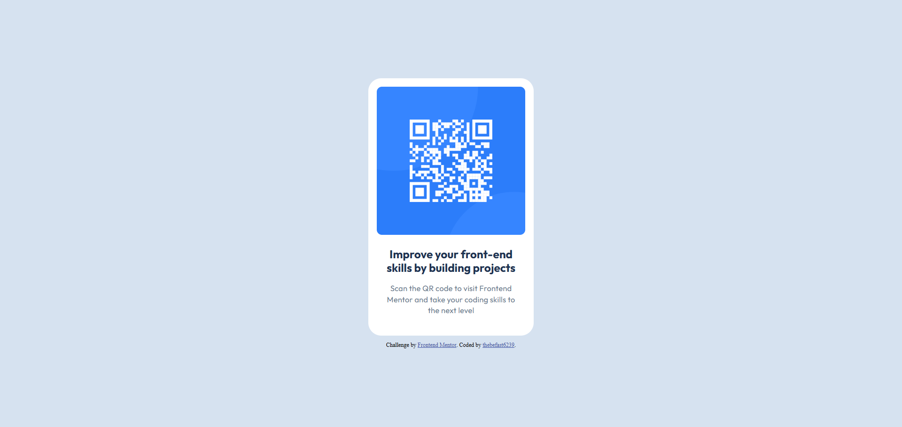

# Frontend Mentor - QR code component solution

This is a solution to the [QR code component challenge on Frontend Mentor](https://www.frontendmentor.io/challenges/qr-code-component-iux_sIO_H). Frontend Mentor challenges help you improve your coding skills by building realistic projects. 

## Table of contents

- [Overview](#overview)
  - [Screenshot](#screenshot)
  - [Links](#links)
- [My process](#my-process)
  - [Built with](#built-with)
  - [What I learned](#what-i-learned)
- [Author](#author)


## Overview

### Screenshot



This is a screenshot of my solution.

### Links

- Solution URL: [not ready yet]()
- Live Site URL: [not ready yet]()

## My process

I started by analyzing the design in Figma to understand the layout and spacing requirements.  
I decided to build the project using HTML and CSS, focusing on responsive design using flexbox.  

I used Google Fonts to import the Outfit font and followed the style guide for font sizes, weights, and colors.  
I encountered challenges with spacing between elements, which I solved using flex gap and proper padding.

This project helped me improve my understanding of CSS flexbox and responsive design.

### Built with

- Semantic HTML5 markup
- CSS
- Flexbox
- Mobile-first workflow

### What I learned

```html
<link rel="preconnect" href="https://fonts.googleapis.com">
<link rel="preconnect" href="https://fonts.gstatic.com" crossorigin>
<link href="https://fonts.googleapis.com/css2?family=Outfit:wght@100..900&display=swap" rel="stylesheet">

&nbsp
```
```css
.proud-of-this-css {
    display: flex;
    justify-content: flex-start;
    align-items: center;
    flex-direction: column;
}
```


## Author

- Website - [thebefast6239](https://github.com/thebefast6239)
- Discord - [a0s9d8f7g6h5j4k3l2](https://discord.gg)